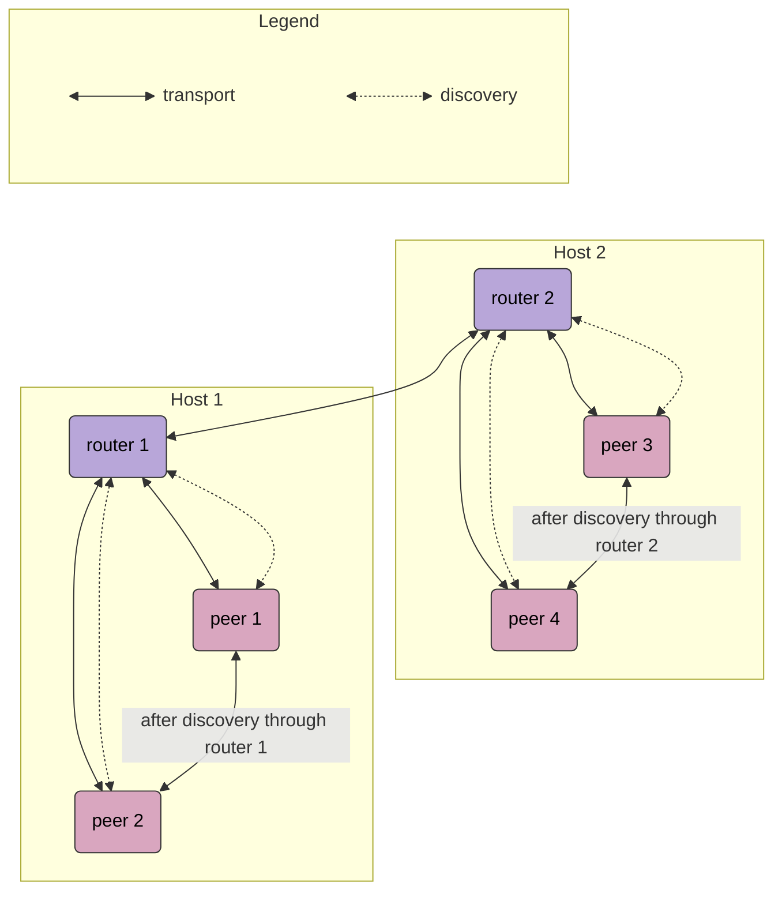
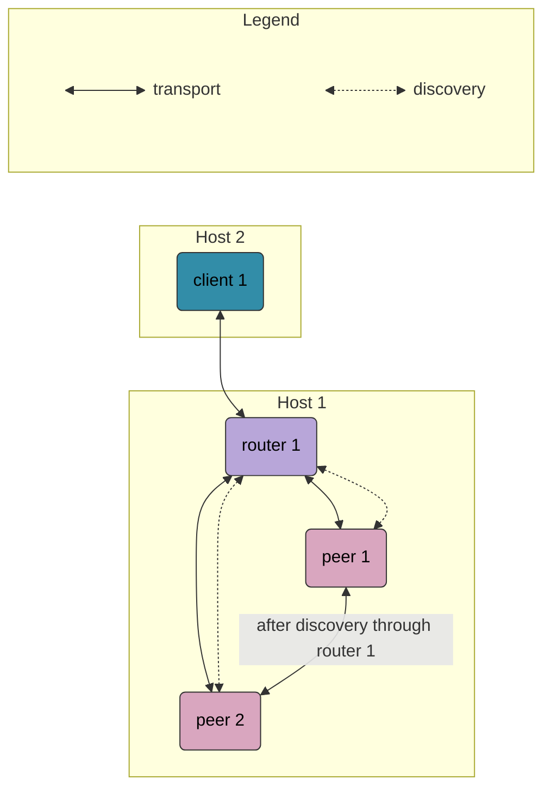
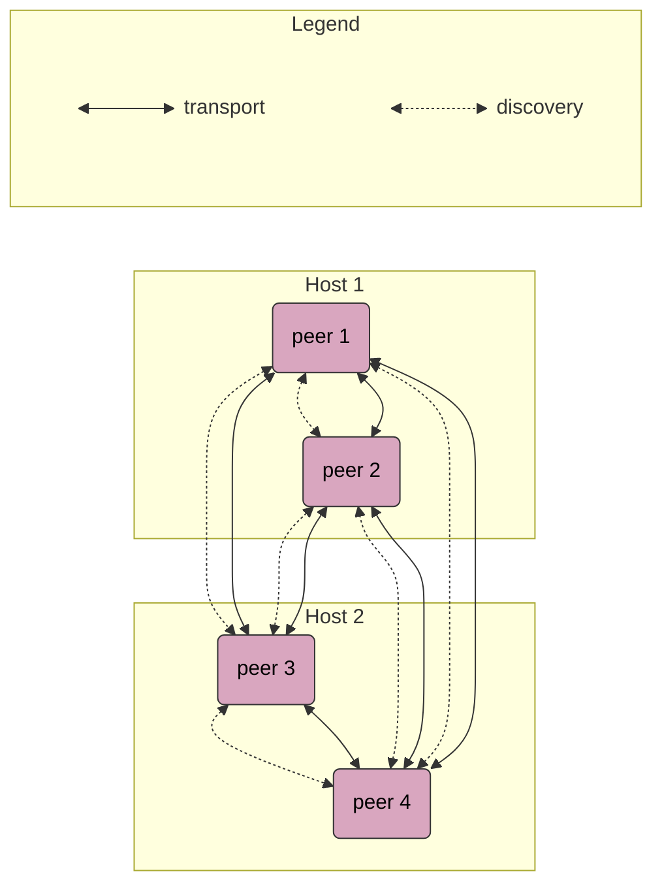
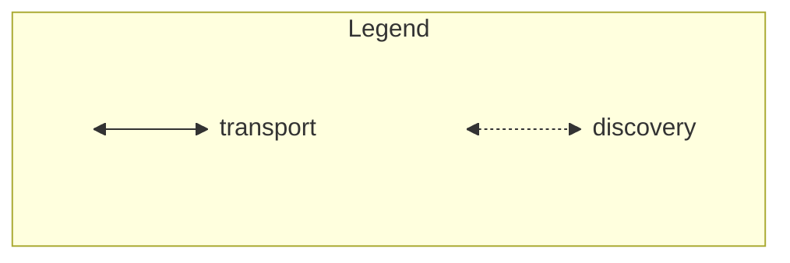
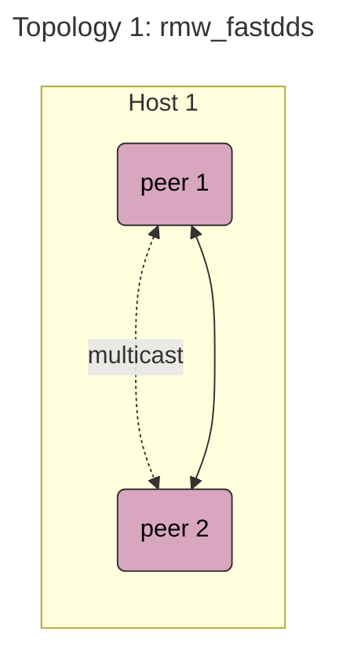
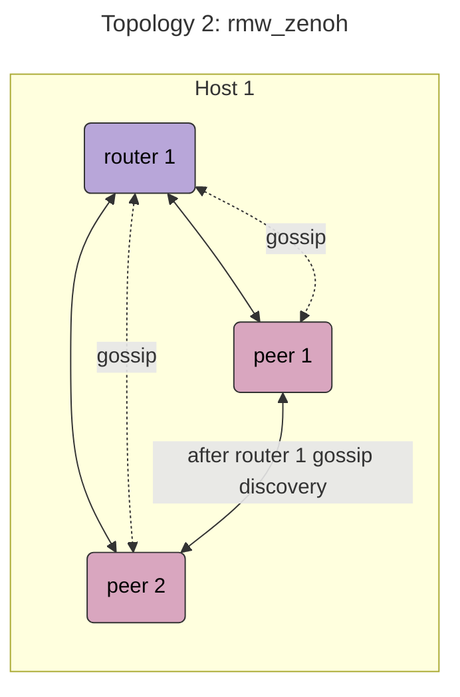
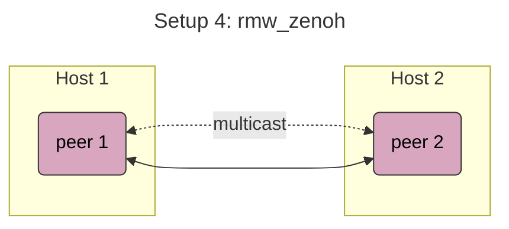
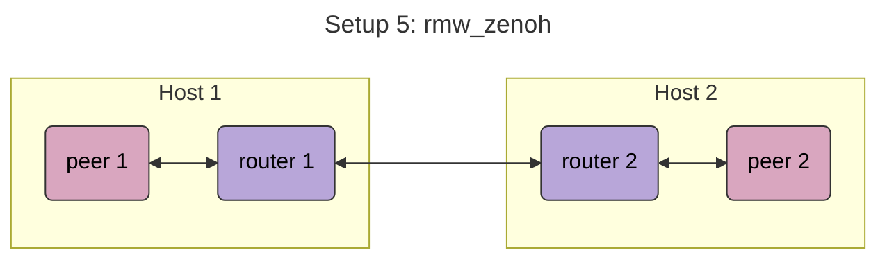
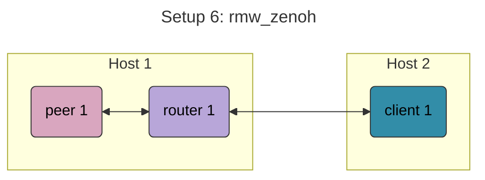

# Table of Contents
- [Understanding Zenoh and rmw_zenoh](#understanding-zenoh-and-rmw_zenoh)
    - [Zenoh](#zenoh)
    - [rmw_zenoh](#rmw_zenoh)
    - [Config file parameters](#config-file-parameters)
        - [mode](#mode)
        - [connect](#connect)
        - [listen](#listen)
        - [scouting](#scouting)
            - [multicast](#multicast)
            - [gossip](#gossip)
- [Demo](#demo)
    - [Setup](#setup)
        - [Docker](#docker)
        - [rmw_zenoh](#rmw_zenoh-1)
    - [Examples](#examples)
        1. [routers and peers](#1-routers-and-peers)
        2. [single router and client](#2-single-router-and-client)
        3. [no routers and only multicast scouting](#3-no-routers-and-only-multicast-scouting)
- [Using ad-hoc wifi](#using-ad-hoc-wifi)
    - [Using IBSS](#using-ibss)
    - [Using B.A.T.M.A.N.](#using-batman)
- [Performance Testing](#performance-testing)


# Understanding Zenoh and rmw_zenoh
This section is mainly for constructing a mental model for understanding Zenoh and how rmw_zenoh implements it. Skip to the [demo](#demo) if needed. The content is based off the official docs for [Zenoh](https://zenoh.io/docs) and [rmw_zenoh](https://github.com/ros2/rmw_zenoh) (as well as conversations with an LLM :p). Note that `rmw_zenoh` implements Zenoh in a specific way with different default behaviours, so the terms `Zenoh` and `rmw_zenoh` will be used to distinguish wherever they differ. 

## Zenoh
All Zenoh applications run as nodes, where their behaviours are configured in a `.json5` config file. Different communication models / topologies use different nodes. See their [docs](https://zenoh.io/docs/getting-started/deployment) for more info. All the available parameters for the config file can be found carefully documented in the [Zenoh default config file](https://github.com/eclipse-zenoh/zenoh/blob/main/DEFAULT_CONFIG.json5) and [rmw_zenoh config files](https://github.com/ros2/rmw_zenoh/tree/rolling/rmw_zenoh_cpp/config) comments, but the important ones will also be documented below.

There are 2 ways to spawn a `Zenoh` node, both of which allow you to pass a config file:
- `zenohd` executable. By default it spawns a router.
- `Zenoh` library. By default it should use the [default config file](https://github.com/eclipse-zenoh/zenoh/blob/main/DEFAULT_CONFIG.json5) params. 

## rmw_zenoh
`rmw_zenoh`, however, distinguishes between 2 types of config files. Both accept the exact same parameters as a regular `Zenoh` config file, but `rmw_zenoh` chooses to use one or another depending on how the `Zenoh` node is spawned:
- router config file: used when spawning a `zenohd` router node. Unless a custom router config file is specified, the [default](https://github.com/ros2/rmw_zenoh/blob/rolling/rmw_zenoh_cpp/config/DEFAULT_RMW_ZENOH_ROUTER_CONFIG.json5) is used.
- session config file: used when running a ROS context. When `rmw_zenoh` is specified as the ros middleware, spawning any ros node automatically spawns a Zenoh node configured by the session config file. Unless a custom session config file is specified, the [default](https://github.com/ros2/rmw_zenoh/blob/rolling/rmw_zenoh_cpp/config/DEFAULT_RMW_ZENOH_SESSION_CONFIG.json5) is used.


## Config file parameters
Some of the important parameters are documented below.

### mode
Each node can run in one of 3 modes:
- `"peer"`: default mode, can open sessions with multiple nodes (usually peers or routers), enabling peer to peer communication.
- `"router"`: can open sessions with multiple nodes (clients, peers or routers) and route application communication between them
- `"client"`: can only open a single session at any one time (usually a router)
```
{
  mode: "peer"
}
```

There are multiple ways for 2 nodes to communicate:
- Directly connect on startup: One node initiates the connection to a reachable node through [connect](#connect) parameter, and the other listens through the [listen](#listen) parameter.
- Through router(s): A router node (or a chain of router nodes) must connect both nodes.
- Discovery through scouting (multicast/gossip): See [scouting](#scouting). Client nodes cannot participate in gossip scouting.

### connect
On startup, the node attempts to connect to other nodes' endpoints, listed in `connect/endpoints` in the format `<protocol>/<ip address>:<port>`. Here, assigning static ip addresses is recommended, and the `rmw_zenoh` recommends using port 7447. 
```
connect: {
  endpoints: [
    "tcp/localhost:7447"
  ],
}
```
`rmw_zenoh` default: 
- `zenohd` router doesn't connect to any endpoint on startup, while peers connect to `localhost:7447`.
- peer and router nodes do not timeout, but client nodes have 0 retries and exit after failing to connect (see `connect/timeout_ms`, `connect/exit_after_failure` and `connect/retry` for more info). Hence, client nodes should only be started after their corresponding router (or peer) nodes.


### listen
Similarly, on startup, the node listens to others' connection attempts on its own endpoints, listed in `listen/endpoints` in the format `<protocol>/<ip address>:<port>`. Use `tcp/<my_address>:0` to listen on all ports. Use the wildcard address `tcp/[::]:7447` to listen on all interface addresses:
- loopback address (localhost or 127.0.0.1)
- wlan0 (e.g. 192.168.1.23)
- eth0 (e.g. 10.42.0.1). 

```
listen: {
  endpoints: [
    "tcp/localhost:7447"
  ],
}
```
`rmw_zenoh` default: 
- `zenohd` router listens on `localhost:7447`.
- peers listen on `localhost:0` (all ports).

### scouting
Instead of explicitly setting endpoints for direct connections through the `connect` and `listen` parameters, nodes can discover one another via multicast or gossip (or both), and then autoconnect. If nodes communicated through an intermediate router node prior to discovery via scouting, they can open up direct peer to peer sessions to one another which persist even after the router is down. 

#### multicast
To use multicast, set `scouting/multicast/enabled` to true so that the node joins the multicast group and discovers other nodes in the group. If `scouting/multicast/listen` is false, it is not discoverable by scout multicast messages from other nodes. `scouting/multicast/autoconnect` dictates what kind of multicast nodes to connect to. `scouting/multicast/autoconnect_strategy` controls strategy for autoconnection. If set to "always", it always attempts to autoconnect which may result in redundant connections. If set to "greater-zid", it will connect to a node with a lesser Zenoh id (see `id` for more info).

```
scouting: {
  multicast: {
    enabled: false,
    autoconnect: { router: [], peer: ["router", "peer"], client: ["router"] },
    autoconnect_strategy: { peer: { to_router: "always", to_peer: "greater-zid" } },
    listen: true,
  }
}
```
`rmw_zenoh` default: 
- `scouting/multicast/enabled` is false
- if `scouting/multicast` is enabled, routers do not autoconnect to any node.

#### gossip
To use gossip, set `scouting/gossip/enabled` to true. Then the node can:
- send gossip messages about any connected node to any other connected node. These 2 nodes may then discover and autoconnect to each other, provided their target/autoconnect
settings allow it and the advertised endpoints are reachable. `scouting/gossip/target` controls which nodes to send the gossip messages to. If `scouting/gossip/multihop` is true, the node will relay gossip messages it receives. Otherwise it only relays its own gossip messages about its directly connected nodes. 
- discover and autoconnect via gossip messages received from other nodes. 

```
scouting: {
  gossip: {
    enabled: true,
    multihop: false,
    target: { router: ["router", "peer"], peer: ["router"]},
    autoconnect: { router: [], peer: ["router", "peer"] },
    autoconnect_strategy: { peer: { to_router: "always", to_peer: "greater-zid" } },
  }
}
```


# Demo
The demo runs the demo talker and listener nodes from [demo_nodes_cpp](https://index.ros.org/p/demo_nodes_cpp/) using [rmw_zenoh](https://github.com/ros2/rmw_zenoh) as middleware. It uses 2 Raspberry Pi's on the same network, running ROS2 Kilted with Docker, but should also work for any 2 hosts on the same network.

## Setup
### Docker
Ensure [Docker](https://docs.docker.com/engine/install/) is installed 

Pull any of the [official ROS2 images](https://hub.docker.com/r/osrf/ros) and run a container interactively in host mode. This demo uses `ros:kilted-ros-core` and names the container "demo":
```
docker create -it --name demo --network host ros:kilted-ros-core
docker start -ai demo
```

In the Docker container, follow the instructions to install [rmw_zenoh](https://github.com/ros2/rmw_zenoh#installation). This demo installed the binaries instead of building from source:
```
sudo apt update && sudo apt install ros-kilted-rmw-zenoh-cpp
```

### rmw_zenoh
When opening any new terminal, do the following:

- Source ROS. Source your base ROS (replace \<DISTRO\> with your ROS distro) if you installed the `rmw_zenoh` binaries, but if you built rmw_zenoh from source in your workspace, then source the `setup.bash` from the workspace instead.
```
source opt/ros/<DISTRO>/setup.bash

# If built from source
# cd ~/my_workspace
# source install/setup.bash
```
- Terminate the ROS2 daemon started with another RMW (ROS Middleware). If you are already running an rmw_zenoh process then skip this. Without this step, ROS 2 CLI commands (e.g. ros2 node list) may not work properly since they would query ROS graph information from the ROS 2 daemon that may have been started with different a RMW.
```
pkill -9 -f ros && ros2 daemon stop
```

- Configure ROS to use rmw_zenoh for middleware instead of the default Fast DDS:
```
export RMW_IMPLEMENTATION=rmw_zenoh_cpp
```

To use different configs than the `rmw_zenoh` default [router config](https://github.com/ros2/rmw_zenoh/blob/rolling/rmw_zenoh_cpp/config/DEFAULT_RMW_ZENOH_ROUTER_CONFIG.json5) / [session config](https://github.com/ros2/rmw_zenoh/blob/rolling/rmw_zenoh_cpp/config/DEFAULT_RMW_ZENOH_SESSION_CONFIG.json5), make a copy of the default config file and change the desired parameters. Then set the `ZENOH_ROUTER_CONFIG_URI` / `ZENOH_SESSION_CONFIG_URI` environment variable to the path to your modified config file. The default config files without the verbose comments can also be found [in this repo](./default_rmw_zenoh_configs/)
```
export ZENOH_ROUTER_CONFIG_URI=path/to/my/router_config.json5
export ZENOH_SESSION_CONFIG_URI=path/to/my/session_config.json5
```
If a config file is written from scratch with just the desired modified parameters, unspecified parameters may fall back to `Zenoh` instead of `rmw_zenoh` default values, hence the rationale for modifying from the `rmw_zenoh` default config files.

## Examples
For the following demo examples, you can create a copy of the default config files and change only the parameters described, or download the [modified config files](./demo_configs/) directly. Be sure to change the IP addresses to your hosts' actual addresses.

### 1. Routers and peers
This is the standard configuration for `rmw_zenoh`, as prescribed by the default config files:
- Every host/machine spawns a `zenohd` router that connects to other routers on startup, relaying gossip [scouting](#scouting) messages to othe routers and peers.
- Within each host/machine, every ROS context spawns a Zenoh peer that connects to its host's router on startup. Each peer discovers other peers on the same host through the router's gossip, opening up direct sessions for peer-to-peer communication. 
- All inter-host communication (e.g. a ROS node on host 1 to a ROS node on host 2) is relayed through the routers. 



We test a simplified version of this configuration running the `demo_nodes_cpp` talker as peer 1 and running listeners as peers 2 and 3 (no peer 4).

The only required change is to make `host 1` and `host 2` connect to each other's address on port 7447 startup. Technically this is redundant since only either `host 1` or `host 2` needs to initiate the connection while the other just listens. By default their `listen/endpoints` parameter is listening on all interface addresses on port 7447 already, so no changes are needed.

Host 1 router config:
```
{
  mode: "router",
  connect: {
    endpoints: ["tcp/<Host 2 IP>:7447"]
  },
  listen: {
    endpoints: [
      "tcp/[::]:7447"
    ],
  },
  scouting: {
    gossip: {
      enabled: true,
      target: { router: ["router", "peer"], peer: ["router"]},
    },
  },
}
```

Host 2 router config:
```
{
  mode: "router"
  connect: {
      endpoints: ["tcp/<Host 1 IP>:7447"]
  },
  listen: {
    endpoints: [
      "tcp/[::]:7447"
    ],
  },
  scouting: {
    gossip: {
      enabled: true,
      target: { router: ["router", "peer"], peer: ["router"]},
    },
  },
}
```

Instead of hardcoding `connect/endpoints`, you could also make routers discover one another via multicast. However, every router would be connected to every other reachable router, which may be undesirable:
```
{
  multicast: {
    enabled: true,
    autoconnect: {router: ["router"]}
  }
}
```

By default the peers are configured to connect to the router on port 7447 on startup, then receive gossip messages from it before autoconnecting to other peers, so no changes required:
```
{
  mode: "peer",
  connect: {
    endpoints: [
      "tcp/localhost:7447"
    ],
  },
  listen: {
    endpoints: [
      "tcp/localhost:0"
    ],
  },
  scouting: {
    gossip: {
      enabled: true,
      autoconnect: { router: [], peer: ["router", "peer"] },
    },
  },
}
```

Start the routers on both hosts:
```
ros2 run rmw_zenoh_cpp rmw_zenohd
```

Start the talker on Host 1:
```
ros2 run demo_nodes_cpp talker
```

Start the listeners on both hosts:
```
ros2 run demo_nodes_cpp listener
```

Check that the published messages are in sync on the talker and listeners. You can also verify on host 2 that there are 2 subscribers to the `/chatter` topic:
```
ros2 topic info /chatter
```


### 2. Single router and client
As per the [docs](https://github.com/ros2/rmw_zenoh#connecting-to-the-zenoh-router-on-another-host), in some scenarios we want to connect to the Zenoh router on another host directly for better performance. For example, it's more efficient to connect to the `zenohd` of a robot while running RViz remotely. 


For the demo we will run a simple remote listener client on Host 2 which connects to Host 1's router on startup, with the following session config:
```
{
  mode: "client",
  connect: {
    endpoints: ["tcp/<Host 1 IP>:7447"]
  }
}
```

Here we can technically also use "peer" mode, so Host 2's node will connect directly to Host 1's peers after discovery via the router. But this may be undesirable if they are not reachable and it's cleaner to expose a single endpoint through the router. 

The router and session configs for Host 1 are the same as in the previous example.    

Start the router on just Host 1:
```
ros2 run rmw_zenoh_cpp rmw_zenohd
```

Start the talker on Host 1:
```
ros2 run demo_nodes_cpp talker
```

Start the listeners on both hosts:
```
ros2 run demo_nodes_cpp listener
```

Check that the published messages are in sync on the talker and listeners.

### 3. No routers and only multicast scouting
This fully peer to peer configuration may be desirable for lower latency for small enough systems on the same network. This is similar to Fast DDS' multicast configuration.



We shall only run a single talker on Host 1 (and not on Host 2 to avoid duplicate /chatter messaages) and a single listener on Host 2.

The peers do not need to connect to explicit endpoints on startup since we are using multicast for discovery. By default they listen only on localhost, so we make them listen to all interface addresses so peers on different hosts are reachable. Then we enable multicast to true, and by default peers already autoconnect to other peers. Session config for both hosts:
```
mode: "peer",
  connect: {
    endpoints: []
  },
  listen: {
    endpoints: ["tcp/[::]:7447"]
  },
  scouting: {
  multicast: {
    enabled: true,
    autoconnect: { router: [], peer: ["router", "peer"], client: ["router"] },
  },
}
```

Start the talker on Host 1:
```
ros2 run demo_nodes_cpp talker
```

Start the listener on Host 2:
```
ros2 run demo_nodes_cpp listener
```

Check that the published messages are in sync on the talker and listener without the need for a router.

# Using ad-hoc wifi mesh network
## Using IBSS
To use `rmw_zenoh` over IBSS, simply ensure that the `connect\endpoints` and `listen\endpoints` parameters in the zenoh router and session config files are set to the correct IBSS IP addresses.

Thx to James for this part lol.

To setup IBSS over an interface (e.g. wlan0), run the following code, replacing `<iface>`,`<ssid>`, `<freq>`, `<ipaddr>` with values of your choice. Hosts which need to connect on the IBSS network must be on the same SSID, MHz frequency (channel) and subnet, with their own unique IP addresses. For the list of frequencies and corresponding channels to choose from, see the [wiki](https://en.wikipedia.org/wiki/List_of_WLAN_channels) (2.4 Ghz or 5 Ghz for raspberry pi and most machines). Note that if you are SSH'ed into your machine on the same interface you are setting up IBSS on (e.g. wlan0), this will terminate your connection. To continue establishing an SSH connection, you can set up your machine to join the ibss network, or SSH via an ethernet cable.

```
# Stop NetworkManager and wpa_supplicant so they don't switch wifi back to managed mode
sudo systemctl stop NetworkManager
sudo systemctl stop wpa_supplicant

# Bring wlan0 interface down first in order to switch to IBSS mode
sudo ip link set <interface> down
sudo iw <interface> set type ibss
sudo ip link set <interface> up

# Set the IBSS network SSID and frequency
sudo iw <interface> ibss join <ssid> <freq>

# Assign the IBSS IP address
sudo ip addr add <ipaddr> dev <interface>
```

Altenatively, download and run the [ibss-setup.sh](./ibss_batman_scripts/ibss-setup.sh) shell script. Be sure to check (and change if needed) the `IFACE`, `SSID`, `FREQ` and `IPADDR` variables. 

To return wifi back to managed mode, run the following:
```
# Remove all ip addresses assigned to interface (e.g. wlan0)
sudo ip addr flush dev <iface>

# Return interface (e.g. wlan0) to normal Wi-Fi client mode
sudo ip link set <iface> down
sudo iw dev <iface> set type managed
sudo ip link set <iface> up

# Restart NetworkManager and wpa_supplicant since we stopped it earlier
sudo systemctl start NetworkManager
sudo systemctl start wpa_supplicant

# Give control back to normal networking services
sudo nmcli dev set "$IFACE" managed yes
```

Alternatively, run the [ibss-teardown.sh](./ibss_batman_scripts/ibss-teardown.sh) shell script.

## Using B.A.T.M.A.N.
Similarly, to use `rmw_zenoh` over BATMAN, simply set the endpoints in the zenoh router and session config files to the correct BATMAN IP addresses.

Ensure `batctl`, the control tool for BATMAN, is installed:
```
sudo apt update
sudo apt install batctl -y
```

To setup BATMAN over a chosen interface (e.g. wlan0), run the following code, replacing `<iface>`, `<ssid>`, `<freq>`, `<ipaddr>` with values of your choice:
```
# Stop NetworkManager and wpa_supplicant so they don't switch wifi back to managed mode
sudo systemctl stop NetworkManager
sudo systemctl stop wpa_supplicant

# Load batman-adv
sudo modprobe batman-adv

# Clean the old config
sudo ip link set bat0 down
sudo batctl if del <iface>
sudo ip addr flush dev <iface>
sudo ip addr flush dev bat0

# Bring interface (e.g. wlan0) down first in order to switch to IBSS mode
sudo ip link set <iface> down
sudo iw <iface> set type ibss
sudo ip link set <iface> up

# Set the IBSS network SSID and frequency
sudo iw <iface> ibss join <ssid> <freq>

# Add interface (e.g. wlan0) to BATMAN
sudo batctl if add <iface>

# Bring bat0 up
sudo ip link set up dev bat0

# Assign the BATMAN IP address
sudo ip addr add <ipaddr> dev bat0
```

Altenatively, download and run the [ibss-batman-setup.sh](./ibss_batman_scripts/ibss-batman-setup.sh) shell script. Be sure to check (and change if needed) the `IFACE`, `SSID`, `FREQ` and `IPADDR` variables. 

To return wifi to managed mode, run the following:
```
# Stop BATMAN virtual interface
sudo ip link set bat0 down

# Detach interface (e.g. wlan0) from BATMAN
sudo batctl if del <iface>

# Clear IPs from BATMAN and Wi-Fi interfaces
sudo ip addr flush dev bat0
sudo ip addr flush dev <iface>

# Return interface (e.g. wlan0) to normal Wi-Fi client mode
sudo ip link set <iface> down
sudo iw dev <iface> set type managed
sudo ip link set <iface> up

# Give control back to normal networking services
sudo systemctl start NetworkManager
sudo systemctl start wpa_supplicant
sudo nmcli dev set <iface> managed yes
```

Alternatively, run the [ibss-batman-teardown.sh](./ibss_batman_scripts/ibss-batman-teardown.sh) shell script.

Useful batctl commands for checking the underlying BATMAN mesh topology:
```
# See only direct neighbours
sudo batctl neighbors

# See all originators, i.e. including hosts reachable by multihop
sudo batctl originators
```

To verify that multihop is being used between 2 hosts in a B.A.T.M.A.N. physically separate them until they see each other as neighbours but not originators.

# Performance Testing
Latency and bandwith were tested to compare different hardware setups (B.A.T.M.A.N. vs router) and ros middleware setups (rmw_zenoh vs rmw_fastdds).

## B.A.T.M.A.N.
This was purely intended to test the connectivity of a B.A.T.M.A.M. mesh network, and hence `rmw_zenoh` wasn't tested. See [below]() for 

### Setup 


### Latency
To measure TCP roundtrip latency, we use [`sockperf`](https://github.com/mellanox/sockperf), a network benchmarking utility with low overhead. To install `sockperf`:
```
sudo apt update
sudo apt install -y sockperf
```

Run the following on the chosen host to start the server on port 11111
```
sockperf server --tcp -p 11111
```

Run the following on the chosen host to start the client on port 11111 and begin a 30 second test to measure full round trip time. Ping Pong mode is used to measure single packet latency.
```
sockperf ping-pong --tcp -i <server-ip-address> -p 11111 -t 30 --full-rtt
```

The results were as follow: 
| Client | Server | Network | Avg Latency (ms) | 
| :----: | :----: | :-----: | :----------: |
|  Pi2   |  Pi3   | Router  |     1.615    |
|  Pi2   |  Pi3   | BATMAN  |     4.918    |
|  Pi1   |  Pi3   | BATMAN  |     4.906    |
|  Pi1   |  Pi3   | BATMAN  |     3.190*   |
*Dual High Gain Antennas deployed on Pi2

### Bandwidth
To measure maximum achievable TCP  bandwidth, we use [`iperf3`](https://github.com/esnet/iperf), which can be installed via:
```
sudo apt update
sudo apt install -y iperf3
```

Run the following on the chosen host to start the server
```
iperf3 -s
```

Run the following on the chosen host to start the client and start a 30 second bidirectional test 
```
iperf3 -c <server-ip-address> -t 30 --bidir
```

The results were as follow. Upload and download speeds are measured in terms of bitrate (Megabits/sec): 
| Client | Server | Network | Client Upload | Server Download | Server Upload | Client Download |
| :----: | :----: | :----:  | :-----------: | :-------------: | :-----------: | :-------------: |
| Pi2    | Pi3    | Router  | 15.9          | 15.1            | 47.8          | 46.7            |
| Pi2    | Pi3    | BATMAN  | 0.0961        | 0.0693          | 0.245         | 0.267          |
| Pi1    | Pi3    | BATMAN  | 0.203         | 0.138           | 0.210         | 0.142          |
| Pi1    | Pi3    | BATMAN  | 0.200*        | 0.138*          | 0.979*        | 0.858*         |
*Dual High Gain Antennas deployed on Pi2

## rmw_zenoh

This section seeks to compare bandwidth and latency between `rmw_zenoh` and `rmw_fastdds`. It simulates realistic conditions through replaying a ros bag of 3D lidar data and measuring bandwidth and delay through `ros2 topic` commands.

### Setup
The `rtp_01` dataset from the [NTU VIRAL Dataset](https://ntu-aris.github.io/ntu_viral_dataset/) was chosen. More of such 3D lidar datasets can be found at [
Awesome-3D-LiDAR-Datasets](https://github.com/minwoo0611/Awesome-3D-LiDAR-Datasets). An   Ouster OS1-16 gen 1 was used, publishing [PointCloud2](https://docs.ros.org/en/noetic/api/sensor_msgs/html/msg/PointCloud2.html) messages on the `/os1_cloud_node1/points` topic at 10Hz, with a message size of 1.57MB. The original ros bag has been reduced to contain just this topic and the first 80 seconds of recording. As the `.mcap` file size is 1.3GB in this modified ros bag, [installing Git LFS (Large File Storage)](https://docs.github.com/en/repositories/working-with-files/managing-large-files/installing-git-large-file-storage) is required.

Since messages are plublished to `/os1_cloud_node1/points` with message size 1.57MB at 10Hz, the required bandwidth is 15.7 MB/s. We confirm this by testing the following topologies and comparing `rmw_fastdds` and `rmw_zenoh`. The recorded bandwidth and latency values can then serve as a baseline for further tests later. `ros2 bag play` spawns a publisher node (peer 1 in the diagram) and `ros2 topic` will spawn a subscriber node (peer 2 in the diagram):




Create the subscriber node to measure bandwidth. We use a "best effort" QOS reliability setting as is common for 3D lidar data:
```
ros2 topic bw /os1_cloud_node1/points --qos-reliability best_effort
```

Note that we spawn the subscriber node first so that it will receive all messages from the start for a consistent and fair test. Play the ros bag with `qos_overrides.yaml` which uses "best effort" QOS reliability:
```
cd ./performance_testing
ros2 bag play ./os1_cloud_node1/ --qos-profile-overrides-path qos_overrides.yaml
```

The results were as follow:

| Topology | RMW | Host| Bandwidth (MB/s) | Avg Delay (ms) |
| :------: | :-: | :-: | :--------------: | :------------: |
| 1        | rmw_fastdds | 15.77 |  ?  | 
| 2        | rmw_zenoh   | 15.73 |  ?  | drone demo






The results were as follow:

| Setup | RMW | Configuration | Bandwidth (MB/s) | Avg Delay (ms) |
| :---: | :-: | :-----------: | :--------------: | :------------: |
| 1     | rmw_fastdds | Same host | 15.77 | 8
| 2     | rmw_zenoh   | Same host | 15.73 |
| 3     | rmw_fastdds | Same host | 15.77 |
| 4     | rmw_fastdds | Same host | 15.77 |
| 5     | rmw_fastdds | Same host | 15.77 |
| 6     | rmw_fastdds | Same host | 15.77 |